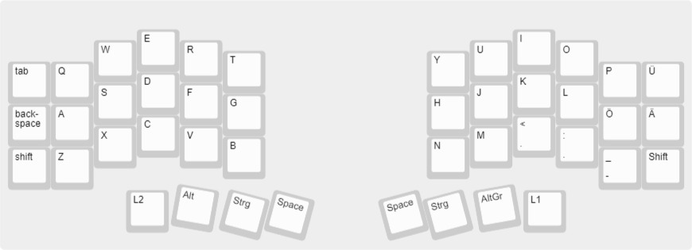

# ErgoSplit50

** table of content **
- [ErgoSplit50](#ergosplit50)
  - [Description](#description)
  - [Price](#price)

## Description 

The ErgoSplit50 is a 50% split keyboard which means that the keyboard is in two half's which is better for ergonomics than a "normal" keyboard. A 50% Keyboard is smaller compared to a normal 100% keyboard with function and number keys as well as a num keys.
The Keyboard has a ortho linear key layout which is more ergonomic than the staggered key layout (normal layout).

___
Here you can see both half of the keyboard built using [Keyboard Layout Editor](http://www.keyboard-layout-editor.com/#/gists/dc776eb6e80d4ed39cddeabd265ff729)  
   
  
___
This keyboard layout is better for ergonomics as it accommodates the different sizes of your fingers. 

## Price

| AMOUNT 	| ITEM                  	| SUPPLIER  	| PRICE  	| SHIPPING 	| PRICE  	| PRICE TOTAL 	    |
|--------	|-----------------------	|-----------	|--------	|----------	|--------	|------------------ |
| 2x     	| RP2040-USB-C          	| Barrybase 	| €5,55  	| €3,33    	| €11,10 	|             	    |
| 1x     	| USB-C 2.0 1m Kabel    	| Barrybase 	| €2,92  	| €5,95    	| €2,90  	|             	    |
| 1x     	| 110 Gateron G PRO RED 	| Keychron  	| €19,-  	| €15,-    	| €34,-  	|             	    |
|        	|                       	|           	| TOTAL: 	| €24,28   	| €48,-  	| **€72,28**      	|
